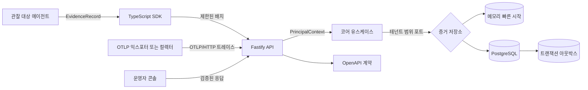

# ProofStack

[English](README.md) | [한국어](README.ko.md)

[](https://github.com/Kwondh0321/proofstack/actions/workflows/ci.yml)

ProofStack은 AI 에이전트를 관찰하고, 재현하고, 평가하고, 통제하며, 안전하게 출시하기
위한 오픈 소스 Agent Reliability Engineering 플랫폼입니다.

> [!IMPORTANT]
> ProofStack은 프로덕션 릴리스가 아닌 실험적 기반 단계에 있습니다. 현재 구현된 경로는
> 선택형 PostgreSQL 영속 저장소, 범위 제한 워크로드 API 키, OIDC 브라우저 세션 백엔드,
> 제한된 OTLP/HTTP 트레이스 수집을 포함해 실제로 작동하고 검증됩니다. 암호화된 아티팩트
> 도메인과 유지보수 경로도 검증되었지만 아직 API 또는 프로덕션 키 공급자와 결합되지
> 않았습니다. 조정된 기준 백업과 격리 복원 절차는 검증되었지만 공급자별 프로덕션 재해
> 복구를 의미하지 않습니다. 콘솔 로그인 연동, 재현, 평가, 릴리스 게이트는 아직 완성된
> 기능으로 표시하지 않습니다.

## ProofStack이 필요한 이유

에이전트를 운영하는 팀에는 로그와 대시보드 이상의 것이 필요합니다. 다음 다섯 가지
질문에 답할 수 있는 검증 가능한 증거가 필요합니다.

1. 에이전트가 무엇을 했는가?
2. 왜 그 경로를 선택했는가?
3. 결과가 정확하고 안전하며 경제적이었는가?
4. 해당 실행을 재현할 수 있는가?
5. 이 버전을 프로덕션에서 실행하도록 허용해도 되는가?

ProofStack은 다음과 같은 연속적인 신뢰성 순환 구조를 중심으로 설계됩니다.

`관찰 -> 재현 -> 평가 -> 집행 -> 출시 -> 학습`

첫 번째 핵심 흐름은 의도적으로 하나의 완결된 과정에 집중합니다. 도구를 사용하는
에이전트를 계측하고, 인과 관계가 보존된 트레이스를 검사하고, 실패를 회귀 테스트
픽스처로 전환하고, 후보 릴리스를 평가한 뒤, 선언된 정책이 퇴보했을 때 출시를
차단하는 과정입니다.

## 현재 작동하는 기능

| 영역 | 기반 단계의 기능 |
| --- | --- |
| 계약 | W3C 트레이스 식별자를 사용하는 엄격하고 버전이 명시된 공급자 중립 `EvidenceEnvelope` |
| 코어 | 테넌트 범위 인가, 멱등 수집, 충돌 감지, 원자적 배치 처리 |
| API | 상태 확인, 직접 JSON 수집, 트레이스 조회, 안정적인 문제 문서, OpenAPI 3.2 |
| OTLP 상호운용성 | OTLP 1.11 트레이스 JSON/Protobuf, gzip, 부분 성공, 제한된 정규화, 인증된 범위 라우팅 |
| 영속성 | 체크섬 검증 PostgreSQL 마이그레이션, 강제 RLS, 불변 증거, 원자적 아웃박스 |
| 전달 상태 | 임대형 아웃박스 재시도, 독성 메시지 가시성, 단조 커서, 소비자 처리 기록 |
| 워크로드 아이덴티티 | 일회 표시 API 키, 제한된 위임, 메모리 경질 해시, 회전·폐기·감사, 격리된 DB 접근 |
| 사용자 아이덴티티 | OIDC Authorization Code + PKCE, 명시적 발급자/주체 바인딩, 암호화된 일회성 트랜잭션, 권위 있는 폐기 가능 세션, CSRF 방어 |
| 아티팩트 수명주기 | 선택형 분류 메타데이터, 봉투 암호화, 불변 S3 호환 객체, PostgreSQL 툼스톤과 삭제 영수증 |
| 아티팩트 운영 | 범위 제한 복구, 보존 기간 처리, 중단 업로드 정리, 삭제 재시도, 참조 키 점검 |
| 복구 | Fail-closed PostgreSQL 덤프, 정규 복구 매니페스트·인벤토리, 빈 대상 조정 복원, 신규 역할, 테넌트 적대적 검증 |
| TypeScript SDK | 식별자 생성, 제한된 큐, 배치 처리, 타임아웃, 기본 fail-open 동작 |
| 콘솔 | 임시 텔레메트리 없이 실제 API 상태와 정확한 트레이스 조회 |
| 예제 | 실제 SDK와 API를 통과하는 부모/자식 에이전트 및 도구 트레이스 |
| 엔지니어링 | 모노레포 경계, 엄격한 TypeScript, 커버리지, 프로덕션 빌드, 고정된 CI 액션 |
| 보안 | 명시적 위협 모델, 안전하지 않은 프로덕션 시작 거부, 의존성·비밀·CodeQL 검사 |

엔드투엔드 기반은 의도적으로 적은 의존성만 요구합니다.



메모리 어댑터는 의존성 없는 빠른 시작을 제공합니다. PostgreSQL 어댑터는 영속 저장
선택지이며, 마이그레이션 무결성, 데이터베이스 수준 테넌트 격리, 불변 증거,
증거·아웃박스 원자적 기록, 서로 격리된 다섯 개의 최소 권한 런타임 역할을 실제 PostgreSQL
테스트로 검증합니다. 실험적 API 키 모드는 워크로드에 대해 엔드투엔드로 작동합니다.
OIDC 브라우저 API도 서버 측 바인딩과 세션을 사용해 작동하지만, 실제 공급자 배포 검증과
운영자 콘솔 로그인 연동은 아직 완료되지 않았습니다. 아티팩트 수명주기는 도메인
라이브러리와 일회성 운영 명령으로 사용할 수 있지만, API 수집·조회 경로, 지속적인
스케줄링, 프로덕션 외부 키 공급자는 아직 완료되지 않았습니다.
제한된 OTLP/HTTP 트레이스 프로필은 표준 JSON 또는 바이너리 Protobuf 익스포터 요청을
`/v1/traces`에서 받습니다. OTLP/gRPC, 트레이스 이외 신호, 분산 할당량, 프로덕션 컬렉터
검증 매트릭스는 구현 완료 범위에 포함되지 않습니다.

## 빠른 시작

요구 사항: Node.js 24 이상, pnpm 11.24.0.

```bash
git clone https://github.com/Kwondh0321/proofstack.git
cd proofstack
pnpm install --frozen-lockfile
pnpm check
pnpm dev
```

API는 <http://127.0.0.1:4318>, 기계 판독 가능한 계약은
<http://127.0.0.1:4318/openapi.json>, 콘솔은 <http://127.0.0.1:3000>에서 시작합니다.

API를 실행한 상태에서 다른 터미널을 열어 실제 SDK 트레이스를 전송합니다.

```bash
pnpm example:basic-agent
```

명령이 생성된 트레이스 ID와 콘솔 URL을 출력합니다. 설정과 문제 해결 방법은
[로컬 개발 가이드](docs/development/local-development.md)를 참고하세요.

## 저장소 구성

```text
apps/api                 HTTP 컴포지션 루트와 개발용 수집 API
apps/web                 서버 렌더링 운영자 콘솔
packages/contracts       런타임 스키마, 공개 타입, 인증 컨텍스트, OpenAPI 생성
packages/core            프레임워크 독립적인 인가 및 증거 유스케이스
packages/artifacts       암호화 콘텐츠 수명주기, 인가, 저장소 포트
packages/postgres        영속 저장소, 마이그레이션, 전달 상태, 런타임 역할
packages/recovery        조정된 복구 매니페스트, 객체 인벤토리, 무결성 검증
packages/s3              불변 S3 호환 아티팩트 객체 어댑터
services/artifact-maintenance  범위 제한 일회성 수명주기·키 안전 명령
services/recovery        안전한 논리 DB 작업과 격리 복구 리허설
sdks/typescript          공급자 중립 텔레메트리 클라이언트
examples/basic-agent     검증된 SDK-API 트레이스 예제
docs/architecture        번호가 지정된 아키텍처 결정 기록
docs/operations          배포 계약과 운영자 절차
docs/product             제품 헌법과 의존 순서가 명시된 로드맵
docs/security            신뢰 경계, 위협, 통제, 프로덕션 게이트
scripts                  저장소 수준 아키텍처 경계 검사
```

내부 의존성 방향은 `pnpm check`에서 강제됩니다. 애플리케이션이 프레임워크 또는 저장소
관심사를 계약과 코어 로직에 조용히 유출할 수 없습니다.

## 타협하지 않는 불변 조건

- 테넌트 소유권은 클라이언트 페이로드가 아니라 서버에서 인증된 컨텍스트로 지정합니다.
- 수신된 증거는 불변이고 멱등성을 가지며, 동일한 이벤트 ID를 다른 내용으로 재사용하면
  거부합니다.
- 텔레메트리 장애는 기본적으로 관찰 대상 워크로드를 중단시키지 않습니다.
- 필수 정책 집행 기능이 구현되면 해당 기능은 fail-closed 방식으로 동작합니다.
- 민감한 콘텐츠 수집은 명시적으로 선택해야 하며 메타데이터 중심 증거와 분리합니다.
- 실험적이거나 예정된 기능은 현재 상태를 숨기지 않고 표시합니다.

넓은 범위의 변경을 시작하기 전에 [제품 헌법](docs/product/constitution.md)을 읽어주세요.
중요한 기술적 결정은 [ADR](docs/architecture/README.md)에 기록하며, 기능 순서와 승인
조건은 [로드맵](docs/product/roadmap.md)에 정의합니다.

[Foundation 1 감사 기록](docs/development/foundation-1-audit.md)에는 영구 저장소 개발 전에
해결한 교차 계층 문제와 여전히 프로덕션 사용을 막고 있는 제한사항이 정리되어 있습니다.
[Foundation 2 영속 코어 감사 기록](docs/development/foundation-2-durable-core-audit.md)에는
남은 단계를 완성했다고 주장하지 않으면서 PostgreSQL과 전달 상태의 승인 근거를 정리합니다.
[Foundation 2 아이덴티티 감사 기록](docs/development/foundation-2-identity-audit.md)에는
워크로드·브라우저 아이덴티티 체크포인트의 승인 근거와 남은 배포 제한사항을 정리합니다.
[Foundation 2 아티팩트 감사 기록](docs/development/foundation-2-artifact-audit.md)에는 API 또는
프로덕션 키 결합을 완성했다고 주장하지 않으면서 암호화 수명주기와 운영자 체크포인트의
승인 근거를 정리합니다.
[Foundation 2 OTLP/HTTP 감사 기록](docs/development/foundation-2-otlp-audit.md)에는 승인된
트레이스 상호운용성 체크포인트, 독립 익스포터 검증 근거와 남은 프로덕션 제한사항을
정리합니다.
[Foundation 2 복구·격리 감사 기록](docs/development/foundation-2-recovery-audit.md)에는 조정된
빈 대상 복원, 마이그레이션·테넌트 경계, 단계 종료 승인과 프로덕션 준비 완료를 막는
제한사항을 정리합니다.

## 현재의 경계

현재 빌드는 콘솔에 연동된 OIDC 로그인, API에 통합된 아티팩트 수집·조회 경로,
프로덕션 외부 아티팩트 키 공급자, 지속적으로 스케줄된 아티팩트 워커, OTLP/gRPC 또는
트레이스 이외 신호 수집, 배포된 아웃박스 발행 서비스, 재현, 평가기, 정책 집행,
지속적인 공급자별 재해 복구, 프로덕션 배포 아티팩트를
제공하지 않습니다. 워크로드 API 키, OIDC 브라우저 인증, 아티팩트 수명주기와 OTLP/HTTP
트레이스 프로필은 구현되고 검증되었습니다. 다만 범용 비밀 탐지, 분산 할당량,
프로덕션 익스포터·컬렉터 매트릭스는 아직 없습니다. Foundation 2의 조정 복구 기준은
고정된 CI 서비스에서 구현되고 검증되었지만, 외부 키 복구, 불변 공급자 백업, 측정된
RPO/RTO, 오프사이트 보존, 반복 배포 리허설은 운영자가 책임져야 합니다. 남은 기능은
명시된 의존 순서를 따르며 로드맵의 보안·호환성 게이트를 건너뛸 수 없습니다.

## 기여와 보안

검토 가능한 변경을 만들기 전에 `pnpm check`를 실행하고, 하나의 커밋에는 하나의 일관된
결정만 담아주세요. 전체 절차는 [CONTRIBUTING.md](CONTRIBUTING.md)를 참고하세요.

보안 취약점을 공개 이슈로 보고하지 마세요. [SECURITY.md](SECURITY.md)의 절차를 따르고
[기반 위협 모델](docs/security/threat-model.md)을 검토하세요.

## 라이선스

Apache License 2.0을 적용합니다. 자세한 내용은 [LICENSE](LICENSE)를 참고하세요.
