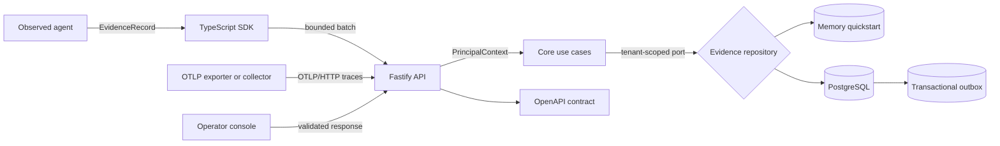

# ProofStack

[English](README.md) | [한국어](README.ko.md)

[](https://github.com/Kwondh0321/proofstack/actions/workflows/ci.yml)

ProofStack is an open-source Agent Reliability Engineering platform for observing, reproducing,
evaluating, governing, and safely releasing AI agents.

> [!IMPORTANT]
> ProofStack is an experimental foundation, not a production release. The implemented path is real
> and tested, including optional PostgreSQL persistence, scoped workload API keys, the OIDC
> browser-session backend, and bounded OTLP/HTTP trace ingestion. The encrypted artifact domain and
> maintenance path are also tested, but are not yet exposed through the API or composed with a
> production key provider. Console sign-in integration, replay, evaluation, backups, and release
> gates are intentionally not represented as complete.

## Why ProofStack

Agent teams need more than logs and dashboards. They need inspectable evidence for five questions:

1. What did the agent do?
2. Why did it take that path?
3. Was the outcome correct, safe, and economical?
4. Can the execution be reproduced?
5. Should this version be allowed to run in production?

ProofStack is designed around a continuous reliability loop:

`observe -> reproduce -> evaluate -> enforce -> release -> learn`

The initial wedge is a single complete workflow: instrument a tool-using agent, inspect its causal
trace, turn a failure into a regression fixture, evaluate a candidate release, and block the
release when a declared policy regresses.

## What works today

| Surface | Foundation capability |
| --- | --- |
| Contract | Strict, versioned, provider-neutral `EvidenceEnvelope` with W3C trace identity |
| Core | Tenant-scoped authorization, idempotent ingestion, conflict detection, atomic batches |
| API | Health, direct JSON ingestion, trace reads, stable problem documents, OpenAPI 3.2 |
| OTLP interoperability | OTLP 1.11 trace JSON/Protobuf, gzip, partial success, bounded normalization, and authenticated scope routing |
| Persistence | Checksum-verified PostgreSQL migrations, forced RLS, append-only evidence, atomic outbox |
| Delivery state | Leased outbox retries, poison-message visibility, monotonic cursors, consumer receipts |
| Workload identity | One-time API keys, bounded delegation, memory-hard hashes, rotation, revocation, audit, and isolated DB access |
| Human identity | OIDC Authorization Code + PKCE, explicit issuer/subject bindings, encrypted one-time transactions, authoritative revocable sessions, and CSRF defense |
| Artifact lifecycle | Opt-in classified metadata, envelope encryption, immutable S3-compatible objects, PostgreSQL tombstones and purge receipts |
| Artifact operations | Scoped reconciliation, retention, abandoned-upload cleanup, purge retry, and referenced-key inspection |
| TypeScript SDK | Generated IDs, bounded queue, batching, timeout handling, fail-open by default |
| Console | API health and exact trace inspection without placeholder telemetry |
| Example | Runnable parent/child agent and tool trace through the real SDK and API |
| Engineering | Monorepo boundaries, strict TypeScript, coverage, production builds, pinned CI actions |
| Security | Explicit threat model, safe production startup refusal, dependency and secret scanning |

The end-to-end foundation is deliberately dependency-light:



The memory adapter keeps the quickstart dependency-free. The PostgreSQL adapter is the durable
option: migration integrity, database-enforced tenant isolation, immutable evidence, atomic
evidence/outbox writes, and five isolated least-privilege runtime roles are covered by real
PostgreSQL tests. The experimental API-key mode is end-to-end functional for workloads. The OIDC
browser API is functional with server-side bindings and sessions; provider deployment validation
and operator console sign-in integration remain unfinished. Artifact lifecycle operations are
available as domain libraries and one-shot operator commands; API capture/read routes, continuous
scheduling, and a production external key provider remain unfinished.
The bounded OTLP/HTTP trace profile accepts standard JSON or binary Protobuf exporters at
`/v1/traces`; OTLP/gRPC, non-trace signals, distributed quotas, and a production collector matrix
remain outside the implemented claim.

## Quickstart

Requirements: Node.js 24+ and pnpm 11.24.0.

```bash
git clone https://github.com/Kwondh0321/proofstack.git
cd proofstack
pnpm install --frozen-lockfile
pnpm check
pnpm dev
```

The API starts at <http://127.0.0.1:4318>, its machine-readable contract at
<http://127.0.0.1:4318/openapi.json>, and the console at <http://127.0.0.1:3000>.

With the API still running, send a real SDK trace from another terminal:

```bash
pnpm example:basic-agent
```

The command prints the generated trace ID and console URL. See the
[local development guide](docs/development/local-development.md) for configuration and
troubleshooting.

## Repository map

```text
apps/api                 HTTP composition root and development ingestion API
apps/web                 Server-rendered operator console
packages/contracts       Runtime schemas, public types, identity, and OpenAPI generation
packages/core            Framework-independent authorization and evidence use cases
packages/artifacts       Encrypted content lifecycle, authorization, and storage ports
packages/postgres        Durable repositories, migrations, delivery state, and runtime roles
packages/s3              Immutable S3-compatible artifact object adapter
services/artifact-maintenance  Scoped one-shot lifecycle and key-safety commands
sdks/typescript          Provider-neutral telemetry client
examples/basic-agent     Verified SDK-to-API trace example
docs/architecture        Numbered architecture decision records
docs/product             Product constitution and dependency-ordered roadmap
docs/operations          Deployment contracts and operator procedures
docs/security            Trust boundaries, threats, controls, and production gates
scripts                  Repository-level architecture enforcement
```

Internal dependency direction is enforced during `pnpm check`; applications cannot silently leak
framework or storage concerns into contracts and core logic.

## Non-negotiable invariants

- Tenant ownership is assigned from server-authenticated context, never a client payload.
- Received evidence is immutable and idempotent; conflicting reuse of an event ID is rejected.
- Telemetry failure does not crash the observed workload by default.
- Mandatory policy enforcement will fail closed when that capability is implemented.
- Sensitive content capture is opt-in and separate from metadata-first evidence.
- Experimental or planned functionality is labeled honestly.

Read the [product constitution](docs/product/constitution.md) before broad changes. Consequential
technical decisions are recorded in [ADRs](docs/architecture/README.md), and capability order and
acceptance gates live in the [roadmap](docs/product/roadmap.md).

The cross-layer [Foundation 1 audit](docs/development/foundation-1-audit.md) records the findings
closed before durable storage work and the limitations that still block production use.
The [Foundation 2 durable core audit](docs/development/foundation-2-durable-core-audit.md) records
the accepted PostgreSQL and delivery-state checkpoint without claiming the remaining stage is done.
The [Foundation 2 identity audit](docs/development/foundation-2-identity-audit.md) records the
accepted workload and browser identity checkpoint and its remaining deployment limitations.
The [Foundation 2 artifact audit](docs/development/foundation-2-artifact-audit.md) records the
accepted encrypted lifecycle and operator checkpoint without claiming API or production-key
composition.

## Current boundaries

The current build does not provide console-integrated OIDC sign-in, API-integrated artifact
capture/read routes, a production external artifact key provider, continuously scheduled artifact
workers, OTLP/gRPC or non-trace signal ingestion, a deployed outbox publisher, replay, evaluators,
policy enforcement, backups, or production deployment artifacts. Workload API-key and OIDC browser
authentication and the artifact lifecycle are implemented and tested. The OTLP/HTTP trace profile
is also implemented, but generic secret detection, distributed quotas, and a production
exporter/collector matrix are not. All remain part of an unfinished foundation rather than a
production-readiness claim. PostgreSQL and S3-compatible storage are durable development
infrastructure, not yet a production data-recovery claim. Remaining capabilities have an explicit
dependency order and may not bypass the security and compatibility gates described in the roadmap.

## Contributing and security

Run `pnpm check` before every reviewable change and keep commits focused on one coherent decision.
See [CONTRIBUTING.md](CONTRIBUTING.md) for the complete workflow.

Do not report vulnerabilities in a public issue. Follow [SECURITY.md](SECURITY.md) and review the
[foundation threat model](docs/security/threat-model.md).

## License

Apache License 2.0. See [LICENSE](LICENSE).
