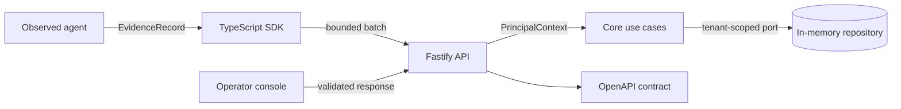

# ProofStack

[](https://github.com/Kwondh0321/proofstack/actions/workflows/ci.yml)

ProofStack is an open-source Agent Reliability Engineering platform for observing, reproducing,
evaluating, governing, and safely releasing AI agents.

> [!IMPORTANT]
> ProofStack is an experimental foundation, not a production release. The implemented path is real
> and tested; durable storage, production authentication, replay, evaluation, and release gates are
> intentionally not represented as complete.

## Why ProofStack

Agent teams need more than logs and dashboards. They need inspectable evidence for five questions:

1. What did the agent do?
2. Why did it take that path?
3. Was the outcome correct, safe, and economical?
4. Can the execution be reproduced?
5. Should this version be allowed to run in production?

ProofStack is designed around a continuous reliability loop:

`observe -> reproduce -> evaluate -> enforce -> release -> learn`

The initial wedge is a single complete workflow: instrument a tool-using agent, inspect its causal
trace, turn a failure into a regression fixture, evaluate a candidate release, and block the
release when a declared policy regresses.

## What works today

| Surface | Foundation capability |
| --- | --- |
| Contract | Strict, versioned, provider-neutral `EvidenceEnvelope` with W3C trace identity |
| Core | Tenant-scoped authorization, idempotent ingestion, conflict detection, atomic batches |
| API | Health, direct JSON ingestion, trace reads, stable problem documents, OpenAPI 3.2 |
| TypeScript SDK | Generated IDs, bounded queue, batching, timeout handling, fail-open by default |
| Console | API health and exact trace inspection without placeholder telemetry |
| Example | Runnable parent/child agent and tool trace through the real SDK and API |
| Engineering | Monorepo boundaries, strict TypeScript, coverage, production builds, pinned CI actions |
| Security | Explicit threat model, safe production startup refusal, dependency and secret scanning |

The end-to-end foundation is deliberately dependency-light:



The repository port is the replacement seam for PostgreSQL. The memory adapter exists for tests
and the quickstart; it is not presented as durable storage.

## Quickstart

Requirements: Node.js 24+ and pnpm 11.24.0.

```bash
git clone https://github.com/Kwondh0321/proofstack.git
cd proofstack
pnpm install --frozen-lockfile
pnpm check
pnpm dev
```

The API starts at <http://127.0.0.1:4318>, its machine-readable contract at
<http://127.0.0.1:4318/openapi.json>, and the console at <http://127.0.0.1:3000>.

With the API still running, send a real SDK trace from another terminal:

```bash
pnpm example:basic-agent
```

The command prints the generated trace ID and console URL. See the
[local development guide](docs/development/local-development.md) for configuration and
troubleshooting.

## Repository map

```text
apps/api                 HTTP composition root and development ingestion API
apps/web                 Server-rendered operator console
packages/contracts       Runtime schemas, public types, identity, and OpenAPI generation
packages/core            Framework-independent authorization and evidence use cases
sdks/typescript          Provider-neutral telemetry client
examples/basic-agent     Verified SDK-to-API trace example
docs/architecture        Numbered architecture decision records
docs/product             Product constitution and dependency-ordered roadmap
docs/security            Trust boundaries, threats, controls, and production gates
scripts                  Repository-level architecture enforcement
```

Internal dependency direction is enforced during `pnpm check`; applications cannot silently leak
framework or storage concerns into contracts and core logic.

## Non-negotiable invariants

- Tenant ownership is assigned from server-authenticated context, never a client payload.
- Received evidence is immutable and idempotent; conflicting reuse of an event ID is rejected.
- Telemetry failure does not crash the observed workload by default.
- Mandatory policy enforcement will fail closed when that capability is implemented.
- Sensitive content capture is opt-in and separate from metadata-first evidence.
- Experimental or planned functionality is labeled honestly.

Read the [product constitution](docs/product/constitution.md) before broad changes. Consequential
technical decisions are recorded in [ADRs](docs/architecture/README.md), and capability order and
acceptance gates live in the [roadmap](docs/product/roadmap.md).

## Current boundaries

The current build does not provide durable persistence, production OIDC or API-key authentication,
artifact content storage, OTLP ingestion, replay, evaluators, policy enforcement, backups, or
production deployment artifacts. Those capabilities have an explicit dependency order and may not
bypass the security and compatibility gates described in the roadmap.

## Contributing and security

Run `pnpm check` before every reviewable change and keep commits focused on one coherent decision.
See [CONTRIBUTING.md](CONTRIBUTING.md) for the complete workflow.

Do not report vulnerabilities in a public issue. Follow [SECURITY.md](SECURITY.md) and review the
[foundation threat model](docs/security/threat-model.md).

## License

Apache License 2.0. See [LICENSE](LICENSE).
