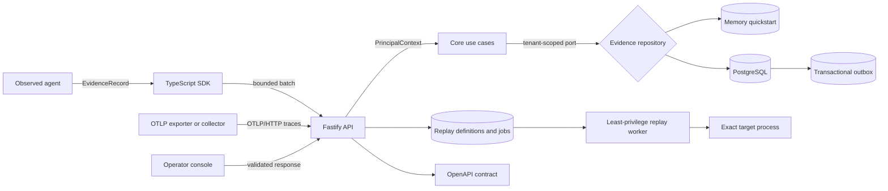

# ProofStack

[English](README.md) | [한국어](README.ko.md)

[](https://github.com/Kwondh0321/proofstack/actions/workflows/ci.yml)

ProofStack is an open-source Agent Reliability Engineering platform for observing, reproducing,
evaluating, governing, and safely releasing AI agents.

> [!IMPORTANT]
> ProofStack is an experimental foundation, not a production release. The implemented path is real
> and tested, including optional PostgreSQL persistence, scoped workload API keys, the OIDC
> browser-session backend, bounded OTLP/HTTP trace ingestion, and retention-safe classified model
> and tool interaction capture. The capture path is API- and SDK-accessible and tested through
> encrypted artifact ownership, revocation, export, and coordinated recovery. Experimental
> durable replay publishes exact releases and plans, persists bounded jobs, budgets, leases,
> cancellation, usage, observations, and encrypted result artifacts, and launches separate worker
> and target processes. Framework-independent non-model evaluation primitives now provide safe
> applicability, digest-bound exact and JSON Schema oracles, and explicit reference aggregates.
> They are not yet composed into persistent evaluation services or operator workflows. The local
> reference is not an OS sandbox, continuously scheduled worker deployment, production key
> provider, or production live-provider integration. Coordinated reference backup and isolated
> restore do not constitute provider-specific production disaster recovery. Console sign-in
> integration, evaluation, and release gates are intentionally not represented as complete.

## Why ProofStack

Agent teams need more than logs and dashboards. They need inspectable evidence for five questions:

1. What did the agent do?
2. Why did it take that path?
3. Was the outcome correct, safe, and economical?
4. Can the execution be reproduced?
5. Should this version be allowed to run in production?

ProofStack is designed around a continuous reliability loop:

`observe -> reproduce -> evaluate -> enforce -> release -> learn`

The initial wedge is a single complete workflow: instrument a tool-using agent, inspect its causal
trace, turn a failure into a regression fixture, evaluate a candidate release, and block the
release when a declared policy regresses.

## What works today

| Surface | Foundation capability |
| --- | --- |
| Contract | Strict, versioned, provider-neutral `EvidenceEnvelope` with W3C trace identity |
| Core | Tenant-scoped authorization, idempotent ingestion, conflict detection, atomic batches |
| API | Health, direct JSON ingestion, trace reads, stable problem documents, OpenAPI 3.2 |
| OTLP interoperability | OTLP 1.11 trace JSON/Protobuf, gzip, partial success, bounded normalization, and authenticated scope routing |
| Persistence | Checksum-verified PostgreSQL migrations, forced RLS, append-only evidence, atomic outbox |
| Delivery state | Leased outbox retries, poison-message visibility, monotonic cursors, consumer receipts |
| Workload identity | One-time API keys, bounded delegation, memory-hard hashes, rotation, revocation, audit, and isolated DB access |
| Human identity | OIDC Authorization Code + PKCE, explicit issuer/subject bindings, encrypted one-time transactions, authoritative revocable sessions, and CSRF defense |
| Artifact lifecycle | Opt-in classified metadata, envelope encryption, immutable S3-compatible objects, PostgreSQL tombstones and purge receipts |
| Artifact operations | Scoped reconciliation, retention, abandoned-upload cleanup, purge retry, and referenced-key inspection |
| Recovery | Fail-closed PostgreSQL dumps, canonical recovery manifests and inventories, empty-target coordinated restore, audited replay-epoch fencing, fresh roles, and tenant-adversarial verification |
| Regression catalog | Immutable observed trace snapshots and ordered dataset versions through memory, PostgreSQL, API, OpenAPI, SDK, outbox, and recovery boundaries |
| Interaction capture | Fixture-owned classified model and tool attempts, exact artifact lineage, metadata/content export, revocation, purge, and recovery |
| Recorded-boundary replay | Strict full-content preflight, ordered exact normalized-request matching, no live fallback, cooperative fixed runtime inputs, and bounded or unknown results |
| Durable replay jobs | Immutable releases and plans, finite multidimensional budgets, fenced leases and restore epochs, cancellation, predeclared retry/effect rules, usage reconciliation, separate worker/target processes, and durable result artifacts |
| Non-model evaluation primitives | Total tri-state applicability, digest-registered exact-byte and bounded JSON Schema oracles, exact five-verdict counts, and assumption-gated Wilson intervals |
| TypeScript SDK | Generated IDs, bounded telemetry delivery, and fail-closed exact-version regression and replay clients with explicit authentication modes |
| Console | API health and exact trace inspection without placeholder telemetry |
| Examples | Runnable trace, evidence-only regression, capture-to-recorded replay, and durable success/cancellation/stale-fence recovery flows through real service boundaries |
| Engineering | Monorepo boundaries, strict TypeScript, coverage, production builds, pinned CI actions |
| Security | Explicit threat model, safe production startup refusal, dependency and secret scanning |

The end-to-end foundation is deliberately dependency-light:



The memory adapter keeps the quickstart dependency-free. The PostgreSQL adapter is the durable
option: migration integrity, database-enforced tenant isolation, immutable evidence, atomic
evidence/outbox writes, and six isolated least-privilege runtime roles are covered by real
PostgreSQL tests. The experimental API-key mode is end-to-end functional for workloads. The OIDC
browser API is functional with server-side bindings and sessions; provider deployment validation
and operator console sign-in integration remain unfinished. Artifact lifecycle and
interaction-capture operations are available through the API and TypeScript SDK as well as domain
libraries and one-shot operator commands. Continuous maintenance scheduling and a production
external key provider remain unfinished.
The bounded OTLP/HTTP trace profile accepts standard JSON or binary Protobuf exporters at
`/v1/traces`; OTLP/gRPC, non-trace signals, distributed quotas, and a production collector matrix
remain outside the implemented claim.

## Quickstart

Requirements: Node.js 24+ and pnpm 11.24.0.

```bash
git clone https://github.com/Kwondh0321/proofstack.git
cd proofstack
pnpm install --frozen-lockfile
pnpm check
pnpm dev
```

The API starts at <http://127.0.0.1:4318>, its machine-readable contract at
<http://127.0.0.1:4318/openapi.json>, and the console at <http://127.0.0.1:3000>.

With the API still running, send a real SDK trace from another terminal:

```bash
pnpm example:basic-agent
```

Then exercise the first Workflow 1 vertical path:

```bash
pnpm example:incident-to-regression
```

The second command emits a failed trace, freezes one exact evidence-only fixture, publishes one
dataset version, reads both versions back, and prints their immutable digests. See the
[incident-to-regression guide](docs/guides/incident-to-regression.md) for authority, idempotency,
failure, and non-replay boundaries.

To capture and then revoke an exact provider-neutral model/tool interaction boundary:

```bash
pnpm example:interaction-capture
```

The example stores eleven dedicated classified artifacts, publishes an immutable
`recorded_interactions` successor, verifies plaintext-free metadata and acknowledged exact-content
exports, runs one exact recorded model/tool flow and one forced mismatch outside the API process,
then tombstones and purges the complete owned set. See the
[interaction-capture guide](docs/guides/interaction-capture.md), the
[recorded-boundary replay guide](docs/guides/recorded-boundary-replay.md), and the
[local development guide](docs/development/local-development.md) for authority, failure behavior,
configuration, and troubleshooting.

The durable replay reference needs the PostgreSQL and S3-compatible profiles and therefore has a
separate setup procedure. It publishes an exact target release and plan, runs success,
cancellation, and expired-lease recovery jobs through separate worker and target processes, and
persists each terminal report before success. Follow the
[durable replay guide](docs/guides/durable-replay.md); its local credentials and bounded process
profile must not be treated as production configuration or isolation.

## Repository map

```text
apps/api                 HTTP composition root and development ingestion API
apps/web                 Server-rendered operator console
packages/contracts       Runtime schemas, public types, identity, and OpenAPI generation
packages/core            Framework-independent authorization and evidence use cases
packages/datasets        Immutable regression definitions, binary encoding, and public vectors
packages/replay          Canonical bounded-replay definitions and fail-closed recorded execution
packages/artifacts       Encrypted content lifecycle, authorization, and storage ports
packages/postgres        Durable repositories, migrations, delivery state, and runtime roles
packages/recovery        Coordinated recovery manifests, object inventories, and verification
packages/s3              Immutable S3-compatible artifact object adapter
services/artifact-maintenance  Scoped one-shot lifecycle and key-safety commands
services/recovery        Safe logical database operations and isolated recovery rehearsal
services/replay-worker   Fenced durable-attempt execution, accounting, and boundary supervision
sdks/typescript          Provider-neutral telemetry and regression control-plane clients
examples/basic-agent     Verified SDK-to-API trace example
examples/incident-to-regression  Executable evidence-only regression catalog flow
examples/interaction-capture  Provider-neutral capture, recorded replay, mismatch, and revocation flow
examples/durable-replay  Durable success, cancellation, stale-fence recovery, and result flow
docs/architecture        Numbered architecture decision records
docs/product             Product constitution and dependency-ordered roadmap
docs/operations          Deployment contracts and operator procedures
docs/security            Trust boundaries, threats, controls, and production gates
scripts                  Repository-level architecture enforcement
```

Internal dependency direction is enforced during `pnpm check`; applications cannot silently leak
framework or storage concerns into contracts and core logic.

## Non-negotiable invariants

- Tenant ownership is assigned from server-authenticated context, never a client payload.
- Received evidence is immutable and idempotent; conflicting reuse of an event ID is rejected.
- Telemetry failure does not crash the observed workload by default.
- Mandatory policy enforcement will fail closed when that capability is implemented.
- Sensitive content capture is opt-in and separate from metadata-first evidence.
- Experimental or planned functionality is labeled honestly.

Read the [product constitution](docs/product/constitution.md) before broad changes. Consequential
technical decisions are recorded in [ADRs](docs/architecture/README.md), and capability order and
acceptance gates live in the [roadmap](docs/product/roadmap.md).

The cross-layer [Foundation 1 audit](docs/development/foundation-1-audit.md) records the findings
closed before durable storage work and the limitations that still block production use.
The [Foundation 2 durable core audit](docs/development/foundation-2-durable-core-audit.md) records
the accepted PostgreSQL and delivery-state checkpoint without claiming the remaining stage is done.
The [Foundation 2 identity audit](docs/development/foundation-2-identity-audit.md) records the
accepted workload and browser identity checkpoint and its remaining deployment limitations.
The [Foundation 2 artifact audit](docs/development/foundation-2-artifact-audit.md) records the
accepted encrypted lifecycle and operator checkpoint without claiming API or production-key
composition.
The [Foundation 2 OTLP/HTTP audit](docs/development/foundation-2-otlp-audit.md) records the accepted
trace interoperability checkpoint, independent exporter evidence, and remaining production gaps.
The [Foundation 2 recovery and isolation audit](docs/development/foundation-2-recovery-audit.md)
records coordinated empty-target restoration, migration and tenant barriers, the stage exit, and
the limits that still block a production-readiness claim.
The [Workflow 1 regression catalog audit](docs/development/workflow-1-regression-catalog-audit.md)
accepts only the immutable evidence-only catalog checkpoint and lists the replay, evaluation, and
comparison work that remains open.
The [Workflow 1 interaction-capture audit](docs/development/workflow-1-interaction-capture-audit.md)
accepts classified, fixture-owned interaction evidence while explicitly withholding executable
replay authority.
The [recorded-boundary replay entry audit](docs/development/workflow-1-recorded-replay-entry-audit.md)
defines the checkpoint's entry gates. The completed
[recorded-boundary replay audit](docs/development/workflow-1-recorded-replay-audit.md) accepts exact
recorded matching with explicit same-process limits while withholding durable-job, evaluation, and
release authority.
The [durable replay-job entry audit](docs/development/workflow-1-durable-replay-entry-audit.md)
defines the checkpoint's release, budget, fencing, cancellation, worker, persistence, recovery,
and authority gates. The completed
[durable replay-job audit](docs/development/workflow-1-durable-replay-audit.md) accepts the bounded
execution boundary against green local and service gates while withholding evaluation, approval,
release, and production-readiness claims.
The [non-model evaluation primitives guide](docs/guides/non-model-evaluation-primitives.md)
documents the current core-only applicability, oracle, and aggregate boundary and the service,
isolation, qualification, and persistence work that remains open.

## Current boundaries

The current build does not provide console-integrated OIDC sign-in, a production external artifact
key provider, continuously scheduled artifact workers, OTLP/gRPC or non-trace signal ingestion, a
deployed outbox publisher, a continuously scheduled production replay-worker deployment,
OS/container-isolated target workers, service-composed evaluators, policy enforcement, continuous
provider-specific disaster recovery, or production deployment artifacts. Immutable evidence-only regression
versions, fixture-owned classified interaction capture, recorded-boundary replay, and bounded
durable replay jobs with separate local processes are implemented and tested, alongside workload
API-key and OIDC browser authentication, artifact lifecycle, and the OTLP/HTTP trace profile.
Core-only non-model evaluation primitives are implemented and tested, but they do not yet publish,
execute, persist, or expose a complete evaluation run through the API.
Replay does not claim OS-enforced network, filesystem, process, or dependency isolation. The
built-in content inspector rejects structured credential fields and supports configured scanners,
but no scanner proves arbitrary opaque bytes secret-free; scanner
qualification, distributed quotas, and a production exporter/collector matrix remain
deployment-owned. Foundation 2's coordinated recovery reference is implemented and tested against
pinned CI services, but external key recovery, immutable provider backups, measured RPO/RTO,
off-site retention, and repeated deployment rehearsals remain operator-owned.
Remaining capabilities have an explicit dependency order and may not bypass the security and
compatibility gates described in the roadmap.

## Contributing and security

Run `pnpm check` before every reviewable change and keep commits focused on one coherent decision.
See [CONTRIBUTING.md](CONTRIBUTING.md) for the complete workflow.

Do not report vulnerabilities in a public issue. Follow [SECURITY.md](SECURITY.md) and review the
[foundation threat model](docs/security/threat-model.md).

## License

Apache License 2.0. See [LICENSE](LICENSE).
